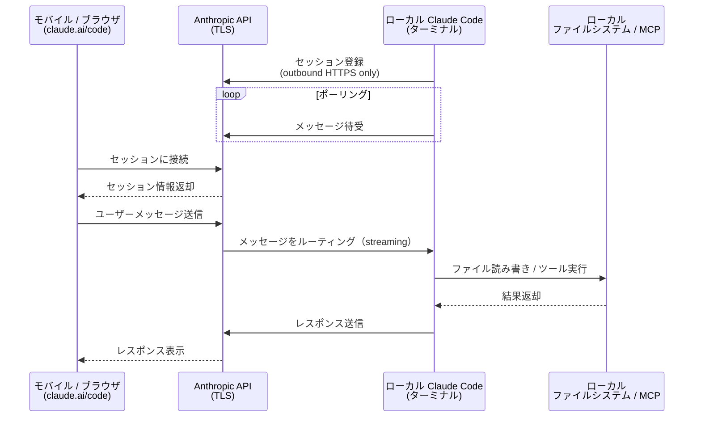
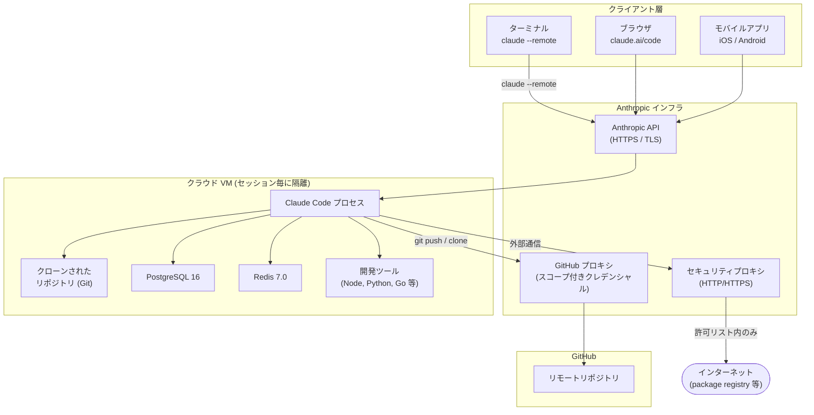
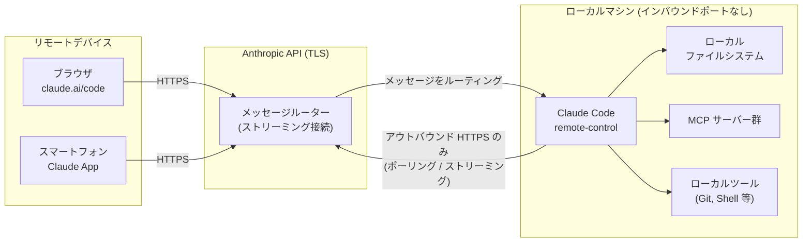
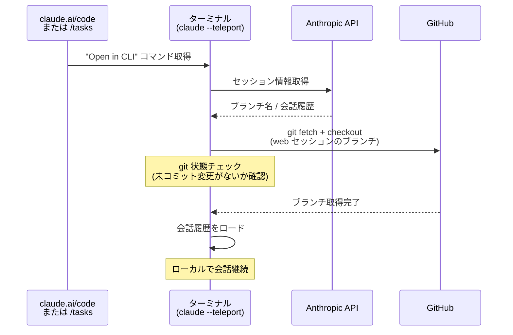

# Claude Code Remote-Control 機能 解説

## 概要

Claude Code には、ローカルセッションをリモートから操作する **Remote Control** と、クラウド上でタスクを実行する **Claude Code on the web** という 2 つのリモート機能がある。両者は `claude.ai/code` や Claude モバイルアプリという同じ UI を共有しているが、**実行場所**が根本的に異なる。

| | Remote Control | Claude Code on the web |
|---|---|---|
| 実行場所 | ローカルマシン | Anthropic 管理クラウド VM |
| ファイルシステム | ローカルの実ファイル | GitHub からクローンした一時 VM |
| MCP サーバー | 利用可能 | 利用不可 |
| セッション永続性 | ターミナルが開いている間のみ | クラウド上で永続 |
| DB (PostgreSQL/Redis) | なし | あり（VM 内にプリインストール） |
| 対象プラン | Pro / Max | Pro / Max / Team / Enterprise |

---

## 1. Remote Control

### 仕組み

```
ローカルマシンが Anthropic API にアウトバウンド HTTPS 接続のみを行う。
インバウンドポートは一切開かない。
```

1. `claude remote-control` を実行すると、ローカルプロセスが Anthropic API に登録される
2. API に対して**ポーリング**し、リモートデバイスからのメッセージを待受ける
3. 別デバイスが `claude.ai/code` やモバイルアプリ経由でアクセスすると、API がメッセージをルーティングする
4. ローカル Claude Code がリクエストを処理し、結果を API 経由で返す

### 起動方法

```bash
# 新規セッション起動
claude remote-control

# オプション
claude remote-control --verbose     # 詳細ログ
claude remote-control --sandbox     # サンドボックス有効化
claude remote-control --no-sandbox  # サンドボックス無効化

# 既存セッションから有効化
/remote-control   # または /rc
```

### 全セッション自動有効化

```
/config → "Enable Remote Control for all sessions" → true
```

### 制約

- 1 セッションにつき同時接続は 1 デバイスのみ
- ターミナルを閉じるとセッション終了
- 10 分以上ネットワーク不通でセッションタイムアウト

---

## 2. Claude Code on the web

### 仕組み

GitHub リポジトリを Anthropic 管理の VM にクローンし、Claude Code を実行する。

```bash
# ターミナルから新規 Web セッション開始
claude --remote "認証バグを修正して src/auth/login.ts"

# 並列タスク実行
claude --remote "テストのフレーキーを修正"
claude --remote "API ドキュメント更新"
claude --remote "ロガーをリファクタリング"
```

### セッション実行フロー

1. リポジトリを VM にクローン
2. SessionStart フックでカスタム環境セットアップを実行
3. ネットワークアクセスを設定（デフォルト: 制限あり）
4. Claude Code がタスクを実行（コード変更・テスト実行）
5. 変更をリモートブランチにプッシュ
6. PR 作成

---

## 3. Teleport（Web → ターミナル）

Web セッションをターミナルに引き込む機能。

```bash
# インタラクティブセッションピッカー
claude --teleport

# 特定セッションを直接再開
claude --teleport <session-id>

# セッション内から
/teleport   # または /tp
/tasks      # バックグラウンドセッション一覧 → t で teleport
```

### Teleport の要件

| 要件 | 詳細 |
|---|---|
| クリーンな git 状態 | 未コミット変更なし（stash でも可） |
| 正しいリポジトリ | フォークではなく元リポジトリのチェックアウト |
| ブランチ利用可能 | リモートブランチが存在すること（自動 fetch） |
| 同一アカウント | Web セッション作成時と同じ Claude.ai アカウント |

---

## 4. /remote-env コマンド

複数の環境が設定されている場合に、`--remote` で使用するデフォルト環境を選択する。

```
/remote-env   # 環境セレクターを開く
```

環境ごとに以下を設定できる：
- **ネットワークアクセスレベル**: No internet / Limited（デフォルト）/ Full
- **環境変数**（`.env` 形式）:
  ```
  API_KEY=your_api_key
  DEBUG=true
  ```

---

## 5. DB・ストレージ

### Remote Control の場合

**DB は使用しない。** ローカルファイルシステムをそのまま利用する。セッション状態は Anthropic API 経由でやり取りされる。

### Claude Code on the web（クラウド VM）の場合

クラウド VM に以下がプリインストールされている：

| DB | バージョン | 用途 |
|---|---|---|
| **PostgreSQL** | 16 | リレーショナルデータが必要なタスク |
| **Redis** | 7.0 | キャッシュ・キュー等 |

これらは Claude がタスク実行中にコードから利用できる。セッション終了後に VM は破棄されるため、データは永続しない（変更はブランチへのプッシュで保存）。

---

## 6. セキュリティ

### Remote Control のセキュリティモデル

- アウトバウンド HTTPS のみ（インバウンドポートなし）
- すべてのトラフィックは Anthropic API を通じて TLS 暗号化
- 複数の短命クレデンシャルを使用（それぞれ独立して有効期限切れ）

### Claude Code on the web のセキュリティモデル

- 各セッションは隔離された VM で動作
- GitHub 認証はスコープ付きクレデンシャルを使用した専用プロキシ経由
- git push はカレントブランチのみに制限
- すべてのアウトバウンドトラフィックはセキュリティプロキシを経由

---

## アーキテクチャ図

### Remote Control の通信フロー



### Claude Code on the web の全体アーキテクチャ



### Remote Control のアーキテクチャ



### Teleport のフロー（Web → ターミナル）



---

## 関連コマンド一覧

| コマンド | 説明 |
|---|---|
| `claude remote-control` | 新規 Remote Control セッション開始 |
| `/remote-control` または `/rc` | 既存セッションから Remote Control 有効化 |
| `claude --remote "<task>"` | Web セッションを新規作成してタスク実行 |
| `claude --teleport` | Web セッションをターミナルに引き込む（ピッカー） |
| `claude --teleport <id>` | 特定の Web セッションを直接 teleport |
| `/teleport` または `/tp` | セッション内から teleport |
| `/tasks` | バックグラウンドセッション一覧表示 |
| `/remote-env` | Web セッション用デフォルト環境を選択 |
| `/rename` | セッション名を変更（remote-control 前に推奨） |
| `/mobile` | Claude モバイルアプリのダウンロード QR を表示 |

---

## 参考リンク

- [Remote Control 公式ドキュメント](https://code.claude.com/docs/en/remote-control)
- [Claude Code on the web 公式ドキュメント](https://code.claude.com/docs/en/claude-code-on-the-web)
- [セキュリティモデル](https://code.claude.com/docs/en/security)
- [データ利用ポリシー](https://code.claude.com/docs/en/data-usage)
